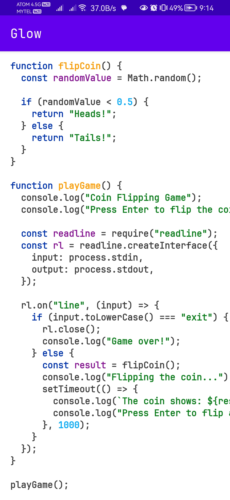

</img>

# glow 
A simple syntax highlighter to use with TextView. Kotlin, Java, JavaScript, and Python are Supported.
[](https://jitpack.io/#com.naulian/glow)

[Jitpack](https://jitpack.io/#com.naulian/glow)

```groovy
allprojects {
    repositories {
        maven { url 'https://jitpack.io' }
    }
}

dependencies {
    implementation 'com.naulian:glow:latest_version'
    //kotlin dsl
    implementation("com.naulian:glow:latest_version")
}
```

```kotlin
val sourceCode = "print('hello')"
val language = "py" //or "python"

val highlighted = glowSyntax(sourceCode, language, CodeTheme.kotlinLight)
//textView.text = highlighted.raw 
textView.setCodeTheme(CodeTheme.kotlinLight.normal)
textView.text = highlighted.spanned

//compose
val annotatedHighLight = Glow.highlight(sourceCode, language, CodeTheme.kotlinLight)
Text(text= annotatedHighLight.value)
```
